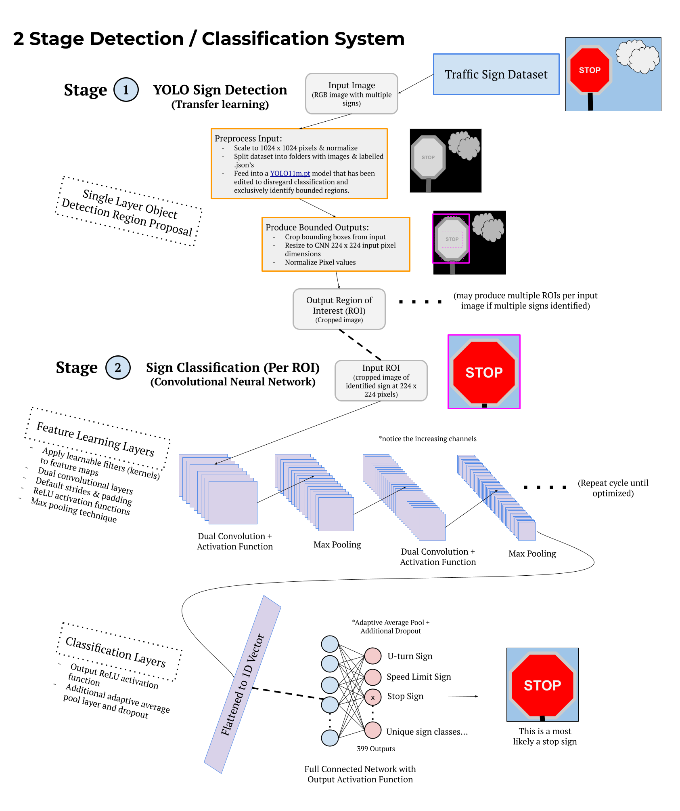

# Traffic Sign Detection & Classification with Deep Learning
## APS360 Deep Learning Project - Two-Stage Traffic Sign Recognition

A prototype traffic-sign recognition system built to explore how a complete autonomous-driving perception workflow can move from a **full road scene** to a **localized sign** and finally to a **specific traffic-sign class**.

The final system uses two deep-learning stages:

1. **YOLOv11m detection** - locate potential traffic signs and return bounding boxes.
2. **Custom CNN classification** - crop each detected region of interest and classify the individual sign.

A major part of the project was not just training the models, but building the dataset and processing pipeline needed to make the two stages work together on a large, inconsistent real-world dataset.

By: **Christopher Lee, Ryan Hammer, Justin Fang & Wenyi (Willis) Wu**  
University of Toronto - **APS360: Applied Fundamentals of Deep Learning**

---

## Demo & Final Presentation

| Project Demo | Final Presentation |
| --- | --- |
|  |  |
| [Watch the project demo](https://www.youtube.com/watch?v=9q1PU-maGwU) | [Watch the final presentation](https://youtu.be/2Rkrkjc61EU) |

**Presentation slides:** [APS360 Final Presentation (Google Slides)](https://docs.google.com/presentation/d/15KnEz0Tg5qyaUHe-0FW0IOmqzT2QzNfEITnDmjHWMv8/edit)

**Final report:** [APS360_Final_Report_Group_58.pdf](docs/APS360_Final_Report_Group_58.pdf)

---

## Repository Structure

This public repository is intended as a **project walkthrough** rather than a source-code release.

- \`README.md\` - full project overview, process, architecture, results, and lessons learned.
- \`assets/two-stage-pipeline.png\` - final high-level detection/classification system diagram.
- \`assets/classification-development-flow.png\` - earlier Stage 2 development and testing workflow.
- \`docs/APS360_Final_Report_Group_58.pdf\` - final written project report.

> **Academic Integrity & Licensing**  
> To comply with academic integrity and plagiarism policies at the University of Toronto, the source code for this course project will **not** be published in this repository.

---

## Project Goal

Traffic-sign recognition is an important part of road-scene understanding for autonomous vehicles. The challenge is that real signs are rarely presented as clean, centered images: they may be small, partially blocked, faded, blurry, distorted by perspective, or captured in difficult lighting.

The goal of this project was to build an end-to-end prototype that could:

- accept a full road-scene image,
- detect one or more traffic signs,
- isolate each detected region,
- classify the sign into its specific category,
- and evaluate how well the combined system holds up on previously unseen real-world images.

The project focused on a **two-stage architecture** so detection and fine-grained classification could be improved independently.

---

## High-Level System Architecture

  

The pipeline separates the problem into two parts:

### Stage 1 - Traffic Sign Detection

A pretrained **YOLOv11m** object-detection model is fine-tuned using transfer learning to find traffic signs inside full road-scene images. Each detected sign is returned as a bounding box with a confidence score.

The detected region is then cropped and resized to **224 x 224** pixels.

### Stage 2 - Traffic Sign Classification

Each cropped region of interest is passed into a custom PyTorch CNN that learns the fine visual differences between sign categories.

This separation was important because the two tasks have different requirements: detection has to find small objects in a large image, while classification can focus entirely on the isolated sign.

---

## 1. Dataset - Mapillary Traffic Sign Dataset

The project used the **Mapillary Traffic Sign Dataset (MTSD)**.

During preprocessing, the team discovered that the raw annotations contained **401 distinct classes**, rather than the 312 classes initially expected from preliminary documentation.

For Stage 1, the working dataset contained **41,916 full-scene images**, split approximately **70 / 15 / 15** for training, validation, and testing.

The original files ranged from roughly 720p road images to 4K images, so the first stage normalized them to **1024 x 1024** while also rescaling every bounding box.

For Stage 2, a new dataset had to be created from the original MTSD images. The team:

- read the original sign annotations,
- cropped every annotated sign into its own image,
- generated new labels for those cropped samples,
- resized each crop to **224 x 224**,
- and rebuilt the train / validation / test metadata.

Because of the size and processing time, roughly **26,000 original images** were processed for Stage 2, producing **more than 130,000 individual sign crops**.

---

## 2. Data Processing Became a Major Engineering Problem

The dataset work ended up being one of the most difficult parts of the project.

The image files and annotation files were not directly paired, so the pipeline needed custom logic to connect every image to the correct JSON annotation and extract:

- the image identifier,
- every traffic-sign bounding box,
- and the class label for each sign.

Loading everything at once repeatedly caused Colab input/output errors and memory problems. To get around this, the workflow was changed so image/annotation pairs were loaded individually instead of keeping the entire dataset in memory.

Resizing also created its own problems. The initial plan was to preserve aspect ratio with padding, but that required different width and height scaling factors plus offset corrections for every bounding box. The added complexity made the process error-prone, so the team moved to normalized 1024 x 1024 inputs instead.

Processing all of the Stage 1 images took roughly **14 hours**, with multiple runtime interruptions during development.

  

This earlier workflow sketch shows the process that evolved into the final classification pipeline: data cleaning, preprocessing, model training, hyperparameter tuning, integration, and testing on real uploaded images.

---

## 3. Design Evolution - From Classical CV to YOLO

The original project proposal planned to generate candidate sign regions using traditional computer-vision techniques such as:

- colour thresholding,
- Canny edge detection,
- contour filtering,
- and OpenCV-based region proposals.

During proposal review, this was identified as a likely system bottleneck because real-world signs are too inconsistent for a fixed rule-based detector to generalize reliably.

The final design therefore replaced the classical detection stage with **YOLOv11m transfer learning**.

That change shifted the project from a traditional-CV + deep-learning hybrid into a fully learned two-stage system, while keeping the original architectural idea of separating detection from classification.

---

## 4. Stage 1 - YOLOv11m Detection

The first stage uses the medium YOLOv11 model as the detector.

The model receives the 1024 x 1024 road-scene image and predicts bounding boxes around likely traffic signs. The best-performing validation weights are then used for inference.

The detector works best when signs are:

- reasonably large,
- visible,
- and not heavily occluded.

Its main weakness is **recall**. Small, distant, partially blocked, or low-quality signs are more likely to be missed entirely.

The final report records approximate detector metrics of:

| Metric | Result |
| --- | ---: |
| Precision | ~0.78 |
| Recall | ~0.65 |
| mAP@50 | ~0.71 |
| mAP@50-95 | ~0.53 |

The final presentation also summarizes Stage 1 at approximately **83% test accuracy**.

---

## 5. Stage 2 - Custom CNN Classifier

The classification network was developed from scratch in PyTorch.

The final architecture uses four convolutional blocks:

| Block | Filters |
| --- | ---: |
| 1 | 32 |
| 2 | 64 |
| 3 | 128 |
| 4 | 256 |

Each block contains:

- two **3 x 3 convolution layers**,
- batch normalization,
- ReLU activations,
- and **2 x 2 max pooling**.

After feature extraction, the network uses:

- global/adaptive average pooling,
- dropout of **0.2**,
- a fully connected layer with **256 hidden units**,
- and a final classification layer for the evaluated sign classes.

The model was trained using cross-entropy loss and the Adam optimizer.

The final presentation reports:

- **Learning rate:** 0.001
- **Epochs:** 100
- **Batch size:** 128
- **Baseline CNN test accuracy:** 79%
- **Custom CNN test accuracy:** 87%

The custom model therefore improved over the shallow baseline while still keeping the architecture small enough to train within the constraints of the project.

---

## 6. Why the Baseline Model Mattered

Before committing to the deeper CNN, the team built a shallow two-convolution-layer baseline inspired by earlier APS360 lab work.

The baseline served as a sanity check for the entire Stage 2 pipeline. If the simple model could learn meaningful structure from the cropped data, it provided evidence that:

- the new dataset had been built correctly,
- labels were being read correctly,
- preprocessing was functioning,
- and the training loop was producing useful gradients.

Only after that baseline was working did it make sense to invest in a larger custom model.

---

## 7. End-to-End Integration

The complete inference process is:

1. Pass a full road image into YOLOv11m.
2. Detect every likely traffic sign.
3. Crop each predicted bounding box.
4. Resize the region to 224 x 224.
5. Pass the crop through the custom CNN.
6. Combine the detection and classification outputs.
7. Draw the resulting label and confidence back onto the original scene.

The integrated pipeline reached roughly **72% end-to-end accuracy** on the held-out test set, where a correct result required the system to both detect the sign and classify it correctly.

The classifier was generally stronger than the full pipeline. Most end-to-end failures came from **missed detections**, not from incorrectly classifying signs that had already been found.

---

## 8. Testing on Completely New Data

To see how the system behaved outside the train/validation/test splits, the team collected **23 new photographs** specifically for final evaluation.

The images intentionally varied:

- time of day,
- downtown vs. suburban environments,
- camera quality,
- camera angle,
- sign density,
- sign size,
- and whether the scene contained any signs at all.

On large and clearly visible signs, detection confidence was often around **0.8-0.92**, while classification confidence for a successfully detected sign was often above **0.95**.

Performance dropped when signs were:

- small,
- blurry,
- partially blocked,
- viewed at extreme angles,
- or captured in poor lighting.

False positives also appeared on bright or sign-like objects.

This real-world test set reinforced the main conclusion of the project: **detection sensitivity was the largest bottleneck in the combined system**.

---

## 9. Quantitative Summary

| System | Reported Result |
| --- | ---: |
| Stage 1 detector | ~83% test accuracy in final presentation |
| Detector precision | ~0.78 |
| Detector recall | ~0.65 |
| Detector mAP@50 | ~0.71 |
| Detector mAP@50-95 | ~0.53 |
| Baseline CNN | 79% test accuracy |
| Custom CNN | 87% test accuracy |
| Full two-stage pipeline | ~72% end-to-end accuracy |

Training accuracy for the custom classifier approached the high 90s while validation plateaued around the high 80s, showing signs of overfitting.

One major reason was **class imbalance**. Some sign categories had far more training examples than others, making generalization weaker for rare classes.

---

## 10. Main Lessons from the Project

### Data engineering can dominate the project

The most time-consuming problems were not necessarily model architecture decisions. They were annotation pairing, resizing, bounding-box transformations, dataset splitting, file I/O, memory limits, and processing time.

### Detection and classification fail differently

A strong classifier does not help if the detector never finds the object. Splitting the pipeline into two stages made it much easier to identify where errors were actually coming from.

### A baseline is useful before adding complexity

The shallow CNN gave the team a reference point and validated the dataset before more time was spent on the deeper architecture.

### Real-world testing changes the picture

Performance on clean held-out samples does not automatically translate to night scenes, small signs, occlusion, motion blur, or unusual viewpoints. The separate 23-image test set exposed failure modes that were less visible in the standard dataset splits.

---

## 11. Limitations & Next Steps

The strongest next improvements would be:

- improve detection recall for small and distant signs,
- rebalance or re-sample underrepresented classes,
- expand the number of annotated examples for rare signs,
- test stronger detection backbones,
- apply more aggressive augmentation for lighting, blur, weather, and occlusion,
- perform more systematic confidence-threshold tuning,
- and evaluate the pipeline on larger real-world driving sequences rather than isolated images.

The project also identified the value of interpretability tools such as Grad-CAM for understanding what the classifier is using to make a decision.

---

## 12. Ethical Considerations

A system like this would need substantially more testing before being used in a safety-critical environment.

Important concerns include:

- **dataset bias** toward more common signs or particular regions,
- reduced reliability in poor weather or lighting,
- unequal performance across rare sign classes,
- privacy issues when collecting street-scene images,
- and the risk of treating a prototype model as reliable enough for autonomous decision-making.

Any real deployment would need broader validation, privacy safeguards, transparent limitations, and a larger safety system around the model.

---

## Technology Used

- **Python**
- **PyTorch**
- **Ultralytics YOLOv11m**
- **OpenCV**
- **Google Colab**
- **Mapillary Traffic Sign Dataset (MTSD)**
- **CNN transfer learning + custom CNN development**

---

## Final Result

The project grew from a traffic-sign classification idea into a full perception pipeline that required **large-scale dataset processing, transfer learning, custom CNN design, model comparison, end-to-end integration, and real-world evaluation**.

The final system was not perfect - especially when signs were small, occluded, or blurry - but it demonstrated the complete flow from a real road image to a detected and classified traffic sign, while making the system's main failure point clear enough to guide the next iteration.
