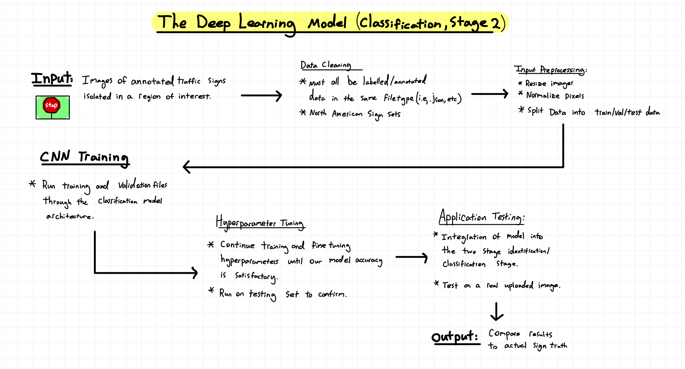

# Traffic Sign Detection & Classification with Deep Learning
## APS360 Deep Learning Project - Two-Stage Traffic Sign Recognition

For our APS360 final project, we built a prototype traffic-sign recognition system to explore how a complete autonomous-driving perception workflow can move from a **full road scene** to a **localized sign** and finally to a **specific traffic-sign class**.

Our final system uses two deep-learning stages:

1. **YOLOv11m detection** - locate potential traffic signs and return bounding boxes.
2. **Custom CNN classification** - crop each detected region of interest and classify the individual sign.

A major part of the project was not just training the models, but building the dataset and processing pipeline needed to make both stages work together on a large, inconsistent real-world dataset.

By: **Christopher Lee, Ryan Hammer, Justin Fang & Wenyi (Willis) Wu**  
University of Toronto - **APS360: Applied Fundamentals of Deep Learning**

---

## Demo & Final Presentation

| Project Demo | Final Presentation |
| --- | --- |
|  |  |
| [Watch the project demo](https://www.youtube.com/watch?v=9q1PU-maGwU) | [Watch the final presentation](https://youtu.be/2Rkrkjc61EU) |

**Presentation slides:** [APS360 Final Presentation (Google Slides)](https://docs.google.com/presentation/d/15KnEz0Tg5qyaUHe-0FW0IOmqzT2QzNfEITnDmjHWMv8/edit)

**Final report:** [APS360_Final_Report_Group_58.pdf](docs/APS360_Final_Report_Group_58.pdf)

---

## Repository Structure

This public repository is intended as a **project walkthrough** rather than a source-code release.

- \`README.md\` - full project overview, process, architecture, results, and lessons learned.
- \`assets/two-stage-pipeline.png\` - original high-level detection/classification system diagram.
- \`assets/classification-development-flow.png\` - earlier Stage 2 development and testing workflow.
- \`docs/APS360_Final_Report_Group_58.pdf\` - final written project report.

The walkthrough below also uses full-slide captures from our final presentation so the visuals stay connected to the explanation rather than being separated into a gallery.

> **Academic Integrity & Licensing**  
> To comply with academic integrity and plagiarism policies at the University of Toronto, the source code for this course project will **not** be published in this repository.

---

## Project Goal

Traffic-sign recognition is an important part of road-scene understanding for autonomous vehicles. The challenge is that real signs are rarely presented as clean, centered images: they may be small, partially blocked, faded, blurry, distorted by perspective, or captured in difficult lighting.

We wanted to build an end-to-end prototype that could:

- accept a full road-scene image,
- detect one or more traffic signs,
- isolate each detected region,
- classify the sign into its specific category,
- and evaluate how well the combined system holds up on previously unseen real-world images.

We focused on a **two-stage architecture** so detection and fine-grained classification could be improved and debugged independently.

---

## High-Level System Architecture

  

The diagram above is a white-backed export of our system diagram so it remains readable in both GitHub light and dark mode.

We separated the problem into two parts:

### Stage 1 - Traffic Sign Detection

We fine-tuned a pretrained **YOLOv11m** object-detection model using transfer learning to find traffic signs inside full road-scene images. Each detected sign is returned as a bounding box with a confidence score.

We then crop each detected region and resize it to **224 x 224** pixels.

### Stage 2 - Traffic Sign Classification

We pass each cropped region of interest into a custom PyTorch CNN that learns the fine visual differences between sign categories.

This separation was important because the two tasks have different requirements: detection has to find small objects in a large image, while classification can focus entirely on the isolated sign.

---

## 1. Dataset - Mapillary Traffic Sign Dataset

We used the **Mapillary Traffic Sign Dataset (MTSD)** for both stages of the project.

While checking the raw annotations, we discovered that the dataset contained **401 distinct classes**, rather than the 312 classes we initially expected from preliminary documentation.

For Stage 1, our working dataset contained **41,916 full-scene images**, split approximately **70 / 15 / 15** for training, validation, and testing.

The original files ranged from roughly 720p road images to 4K images, so we normalized them to **1024 x 1024** while also rescaling every bounding box.

For Stage 2, we built a new dataset from the original MTSD images. We:

- read the original sign annotations,
- cropped every annotated sign into its own image,
- generated new labels for those cropped samples,
- resized each crop to **224 x 224**,
- and rebuilt the train / validation / test metadata.

Because of the size and processing time, we processed roughly **26,000 original images** for Stage 2, producing **more than 130,000 individual sign crops**.

| Dataset overview | Data cleaning & preprocessing |
| --- | --- |
|  |  |

---

## 2. Data Processing Became a Major Engineering Problem

Dataset preparation ended up being one of the hardest parts of our project.

The image files and annotation files were not directly paired, so we needed custom logic to connect every image to the correct JSON annotation and extract:

- the image identifier,
- every traffic-sign bounding box,
- and the class label for each sign.

Loading everything at once repeatedly caused Colab input/output errors and memory problems. We changed the workflow so image/annotation pairs could be loaded individually instead of keeping the entire dataset in memory.

Resizing created another problem. We originally tried preserving aspect ratio with padding, but that required separate width and height scaling factors plus offset corrections for every bounding box. The added complexity made the process much more error-prone, so we moved to normalized **1024 x 1024** inputs instead.

Processing the full Stage 1 set took roughly **14 hours**, and we had to deal with multiple runtime interruptions while developing and validating the preprocessing pipeline.

  

This earlier workflow sketch captures the path we followed as the classification side developed: data cleaning, preprocessing, model training, hyperparameter tuning, integration, and testing on real uploaded images.

---

## 3. Local CUDA-Accelerated GPU Training

We did not rely entirely on Google Colab's hosted GPU availability.

During development, we configured **Google Colab to connect to a local Jupyter runtime** on a Windows workstation equipped with an **NVIDIA GeForce RTX 4070 Ti**. That allowed us to run PyTorch workloads locally with **CUDA acceleration** while still using the Colab notebook interface and the rest of our existing workflow.

We verified the local GPU environment with \`nvidia-smi\`, installed the required Python/PyTorch dependencies on the host machine, and used the local runtime for GPU-heavy training and experimentation.

This was especially useful for longer model iterations because it gave us:

- direct access to a dedicated GPU instead of waiting for a hosted accelerator,
- a more predictable training environment,
- fewer hosted-runtime/session constraints,
- and a practical way to accelerate CNN and detection experiments locally.

The local-GPU setup also became part of our broader prototyping work when we moved from notebook-only testing toward local image/video processing.

---

## 4. Design Evolution - From Classical CV to YOLO

Our original proposal planned to generate candidate sign regions using traditional computer-vision techniques such as:

- colour thresholding,
- Canny edge detection,
- contour filtering,
- and OpenCV-based region proposals.

During proposal review, this was identified as a likely bottleneck because real-world signs are too inconsistent for a fixed rule-based detector to generalize reliably.

We ultimately replaced the classical detection stage with **YOLOv11m transfer learning**.

That decision shifted us from a traditional-CV + deep-learning hybrid into a fully learned two-stage system while preserving our original idea of separating detection from classification.

---

## 5. Stage 1 - YOLOv11m Detection

For Stage 1, we used the medium YOLOv11 model as our detector.

The model receives a **1024 x 1024** road-scene image and predicts bounding boxes around likely traffic signs. We then use the best-performing validation weights for inference.

The detector works best when signs are:

- reasonably large,
- clearly visible,
- and not heavily occluded.

Its main weakness is **recall**. Small, distant, partially blocked, or low-quality signs are more likely to be missed entirely.

The final report records approximate detector metrics of:

| Metric | Result |
| --- | ---: |
| Precision | ~0.78 |
| Recall | ~0.65 |
| mAP@50 | ~0.71 |
| mAP@50-95 | ~0.53 |

Our final presentation also summarizes Stage 1 at approximately **83% test accuracy**.

| Detection under high sign density | Stage 1 quantitative results |
| --- | --- |
|  |  |

These slides show the tradeoff we observed in practice: the detector can handle scenes with many signs, but missed detections and lower-confidence boxes still become the dominant failure mode.

---

## 6. Stage 2 - Custom CNN Classifier

We developed the classification network from scratch in PyTorch.

Our final architecture uses four convolutional blocks:

| Block | Filters |
| --- | ---: |
| 1 | 32 |
| 2 | 64 |
| 3 | 128 |
| 4 | 256 |

Each block contains:

- two **3 x 3 convolution layers**,
- batch normalization,
- ReLU activations,
- and **2 x 2 max pooling**.

After feature extraction, we use:

- global/adaptive average pooling,
- dropout of **0.2**,
- a fully connected layer with **256 hidden units**,
- and a final classification layer for the evaluated sign classes.

We trained the model using cross-entropy loss and the Adam optimizer.

Our final presentation reports:

- **Learning rate:** 0.001
- **Epochs:** 100
- **Batch size:** 128
- **Baseline CNN test accuracy:** 79%
- **Custom CNN test accuracy:** 87%

| Baseline vs. custom CNN architecture | Stage 2 performance |
| --- | --- |
|  |  |

Our custom model improved over the shallow baseline while remaining small enough to train and iterate on within the constraints of the project.

---

## 7. Why the Baseline Model Mattered

Before committing to the deeper CNN, we built a shallow two-convolution-layer baseline inspired by earlier APS360 lab work.

We used it as a sanity check for the entire Stage 2 pipeline. If the simple model could learn meaningful structure from the cropped data, it gave us evidence that:

- our new dataset had been built correctly,
- labels were being read correctly,
- preprocessing was functioning,
- and the training loop was producing useful gradients.

Once the baseline was working, we had a meaningful point of comparison before investing more time in our deeper custom architecture.

---

## 8. End-to-End Integration

Our complete inference process became:

1. Pass a full road image into YOLOv11m.
2. Detect every likely traffic sign.
3. Crop each predicted bounding box.
4. Resize the region to 224 x 224.
5. Pass the crop through our custom CNN.
6. Combine the detection and classification outputs.
7. Draw the resulting label and confidence back onto the original scene.

The integrated pipeline reached roughly **72% end-to-end accuracy** on the held-out test set, where a correct result required us to both detect the sign and classify it correctly.

The classifier was generally stronger than the complete pipeline. Most end-to-end failures came from **missed detections**, not from incorrectly classifying signs that YOLO had already found.

  

The demonstration slide above shows examples of the final system running on real street scenes, with separate confidence values for detection and classification.

---

## 9. Testing on Completely New Data

To see how the system behaved outside the train/validation/test splits, we collected **23 new photographs** specifically for final evaluation.

We intentionally varied:

- time of day,
- downtown vs. suburban environments,
- camera quality,
- camera angle,
- sign density,
- sign size,
- and whether the scene contained any signs at all.

On large and clearly visible signs, detection confidence was often around **0.8-0.92**, while classification confidence for a successfully detected sign was often above **0.95**.

Performance dropped when signs were:

- small,
- blurry,
- partially blocked,
- viewed at extreme angles,
- or captured in poor lighting.

We also saw false positives on bright or sign-like objects.

This real-world test set reinforced our main conclusion: **detection sensitivity was the largest bottleneck in the combined system**.

---

## 10. Quantitative Summary

| System | Reported Result |
| --- | ---: |
| Stage 1 detector | ~83% test accuracy in final presentation |
| Detector precision | ~0.78 |
| Detector recall | ~0.65 |
| Detector mAP@50 | ~0.71 |
| Detector mAP@50-95 | ~0.53 |
| Baseline CNN | 79% test accuracy |
| Custom CNN | 87% test accuracy |
| Full two-stage pipeline | ~72% end-to-end accuracy |

Our custom classifier's training accuracy approached the high 90s while validation plateaued around the high 80s, showing signs of overfitting.

A major reason was **class imbalance**. Some sign categories had far more training examples than others, which made generalization weaker for rare classes.

---

## 11. Main Lessons from the Project

### Data engineering can dominate the project

Some of our most time-consuming problems were not model architecture decisions at all. They were annotation pairing, resizing, bounding-box transformations, dataset splitting, file I/O, memory limits, and processing time.

### Detection and classification fail differently

A strong classifier does not help us if the detector never finds the object. Splitting the pipeline into two stages made it much easier to identify where errors were actually coming from.

### A baseline is useful before adding complexity

Our shallow CNN gave us a reference point and helped validate the Stage 2 dataset before we spent more time on a deeper architecture.

### Real-world testing changes the picture

Performance on clean held-out samples does not automatically translate to night scenes, small signs, occlusion, motion blur, or unusual viewpoints. Our separate 23-image test set exposed failure modes that were less visible in the standard dataset splits.

  

---

## 12. Limitations & Next Steps

If we continued the project, our strongest next improvements would be:

- improve detection recall for small and distant signs,
- rebalance or re-sample underrepresented classes,
- expand the number of annotated examples for rare signs,
- test stronger detection backbones,
- apply more aggressive augmentation for lighting, blur, weather, and occlusion,
- perform more systematic confidence-threshold tuning,
- and evaluate the pipeline on larger real-world driving sequences rather than isolated images.

We also identified the value of interpretability tools such as Grad-CAM for understanding what the classifier is using to make a decision.

---

## 13. Ethical Considerations

We would need substantially more testing before using a system like this in a safety-critical environment.

Important concerns include:

- **dataset bias** toward more common signs or particular regions,
- reduced reliability in poor weather or lighting,
- unequal performance across rare sign classes,
- privacy issues when collecting street-scene images,
- and the risk of treating a prototype model as reliable enough for autonomous decision-making.

Any real deployment would need broader validation, privacy safeguards, transparent limitations, and a larger safety system around the model.

---

## Technology Used

- **Python**
- **PyTorch**
- **CUDA / NVIDIA GPU acceleration**
- **NVIDIA GeForce RTX 4070 Ti local training**
- **Ultralytics YOLOv11m**
- **OpenCV**
- **Google Colab + local Jupyter runtime**
- **Mapillary Traffic Sign Dataset (MTSD)**
- **Transfer learning + custom CNN development**

---

## Final Result

What started as a traffic-sign classification idea became a complete perception pipeline that forced us to work through **large-scale dataset processing, local GPU acceleration, transfer learning, custom CNN design, model comparison, end-to-end integration, and real-world evaluation**.

Our final system was not perfect - especially when signs were small, occluded, or blurry - but it demonstrated the complete flow from a real road image to a detected and classified traffic sign. More importantly, by the end of the project we understood exactly where the system was failing and what we would improve next.
